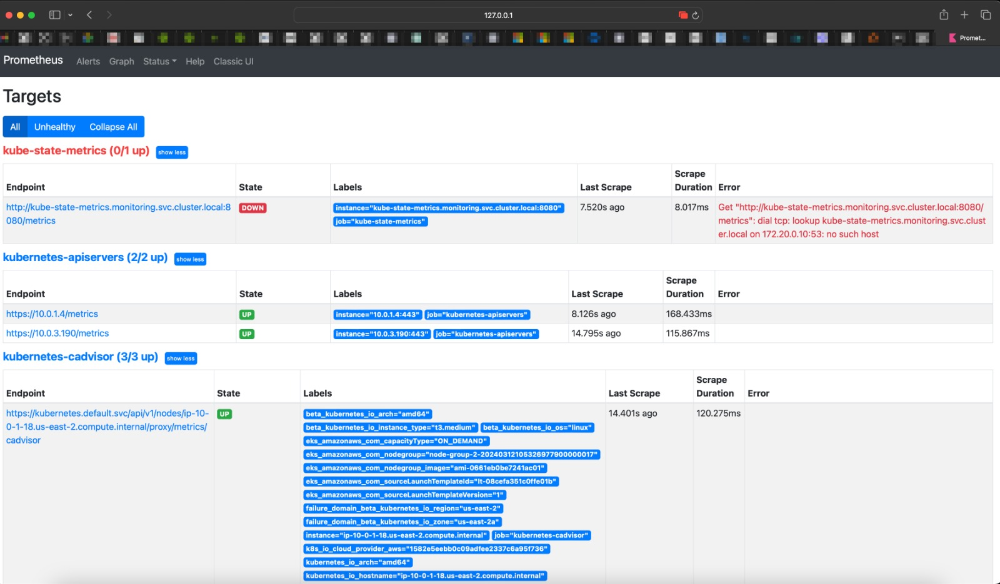
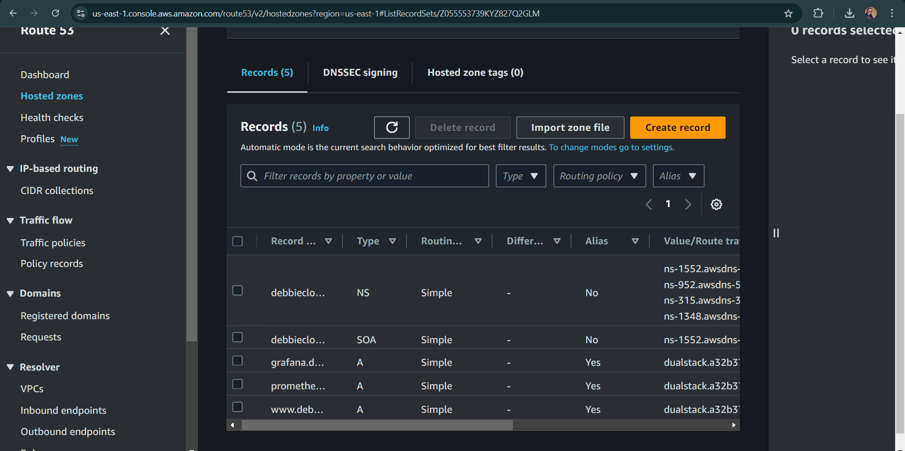
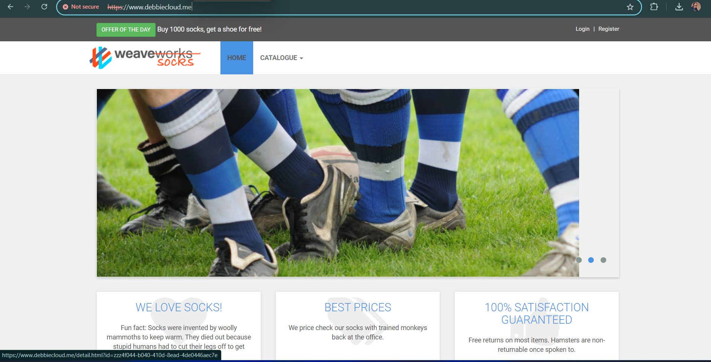
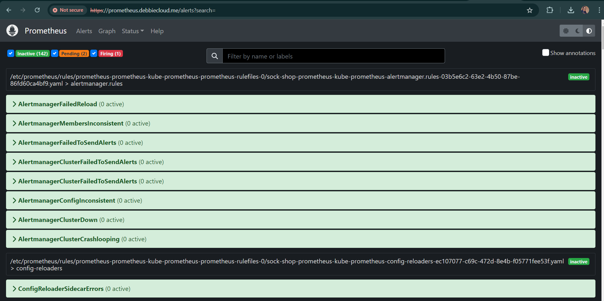
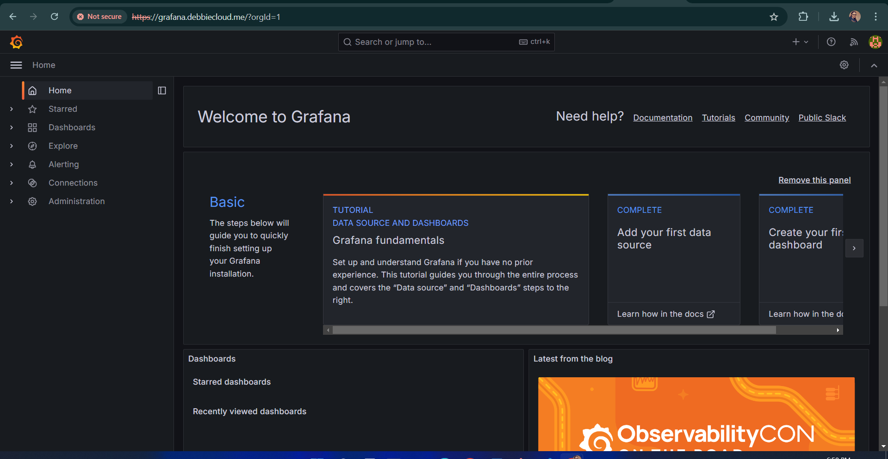
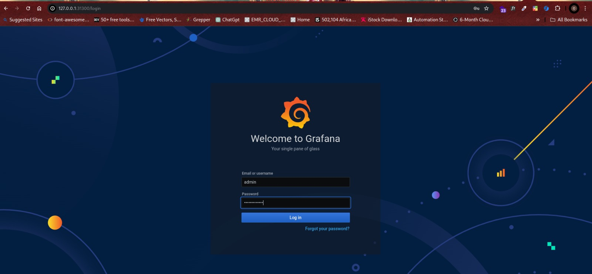
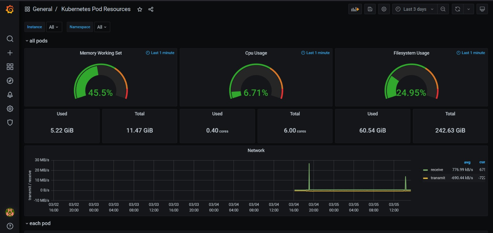

# Objective

● All deliverables need to be deployed using an Infrastructure as Code approach.
In your solution please emphasize readability and maintainability (make yor
application deployment clear)
We expect a clear way to recreate your setup and will evaluate the project decisions
based on:
- Deploy pipeline
- Metrics (Alertmanager)
- Monitoring (Grafana)
- Logging (Prometheus)
- Use Prometheus as a monitoring tool
- Use Ansible or Terraform as the configuration management tool.
- You can use an IaaS provider of your choice.
- The application should run on Kubernetes.

# PROJECT STEPS :-

# Kubernetes Application Deployment with IaC
This project demonstrates the deployment of a Kubernetes-based application using Infrastructure as Code (IaC). The setup includes monitoring and alerting using Prometheus, Grafana, and Alertmanager, with Terraform or Ansible for infrastructure provisioning. 

- https://github.com/microservices-demo/microservices-demo.github.io
- https://github.com/microservices-demo/microservices-demo/tree/master

This above repository contains the necessary files and scripts to deploy a containerized application on a Kubernetes cluster using Infrastructure as Code (IaC). The project focuses on the following key aspects:

- Deploy Pipeline: Automated setup and deployment of infrastructure and applications.
- Metrics & Logging: Integrated monitoring and logging using Prometheus.
- Monitoring: Visual dashboards and alerts using Grafana and Alertmanager.

# Infrastructure Setup
Before starting, ensure that you have the following

IaaS Provider Account: AWS, GCP, Azure, etc.

CLI Tools:
- terraform (if using Terraform)
- ansible (if using Ansible)
- kubectl
- helm
- docker

Access Credentials: Ensure that your CLI tools are authenticated to your IaaS provider.

# Terraform Setup
If you choose to use terraform as for infrastructure provisioning.

* Configure Terraform: Modify the "main.tf" file to define the necessary cloud resources (VPC, subnets, Kubernetes cluster). 
* Initialize Terraform: terraform init
* Plan the Deployment: terraform plan
* Apply the Configuration: terraform apply

# Ansible Setup
if you prefer Ansible:

* Playbook Structure: Create a playbook (site.yml) that includes roles for Kubernetes, Prometheus, and Grafana.
* Run the Playbook: ansible-playbook site.yml

# Kubernetes Deployment
Deploying the Application: 
* Create Deployment YAML: Define your application deployment in "deployment.yaml".
* Apply the Deployment: kubectl apply -f deployment.yaml

Run the following commands step by step
* aws eks update-kubeconfig --name=(clustername) --region=us-east-1
* kubectl describe nodes
* kubectl create namespace sock-shop
* kubectl get ns
* kubectl config set-context --current --namespace=sock-shop
* kubectl create -f (name of your deployment file)
* kubectl get pods
* kubectl get svc
* kubectl get all -A
* kubectl port-forward service/front-end -n sock-shop 30001:80

 

# Exposing the Application
Create a Service:

* Define how the application should be exposed (e.g., LoadBalancer, NodePort) in service.yaml.
* Apply the Service: kubectl apply -f service.yaml

# Route53 
log into your Iaas provider Account and search for "Route 53" then "create record" add your domain name, follow the promt and fill in the reqired spaces. You should get the below image if you filled corretly.

Type your domain name on your browser, your application would be up.

# Monitoring and Alerting
Prometheus Setup
* Configure Prometheus: helm repo add prometheus-community https://prometheus-community.github.io/helm-charts, 
* Update Prometheus: helm repo update
* Install Prometheus: helm install prometheus prometheus-community/kube-prometheus-stack.

After deploying your application, go to your browser and type "promrtheus.(your domain name) your application should be up and responsive.

# Grafana Setup
Install Grafana:
* helm install grafana grafana/grafana
Grafana.(you domain name) 

# Alertmanager Setup
Configure Alertmanager:

* Define alerting rules and notification channels in "alertmanager.yaml".
* Apply the Configuration: kubectl apply -f alertmanager.yaml

readme.md
Displaying readme.md.